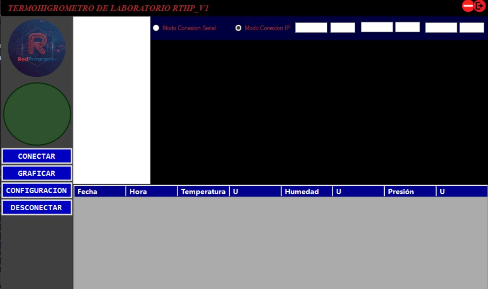
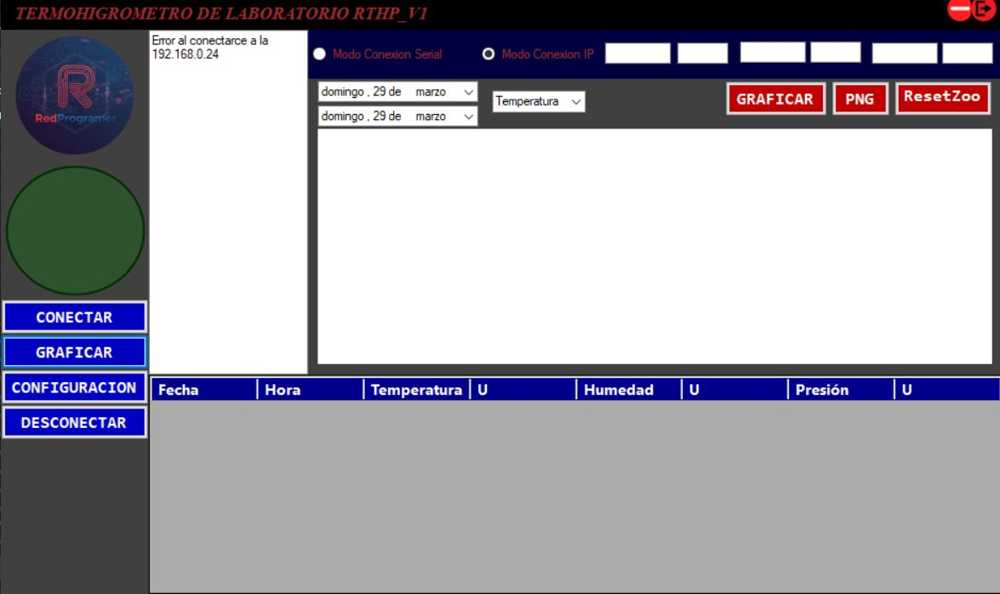
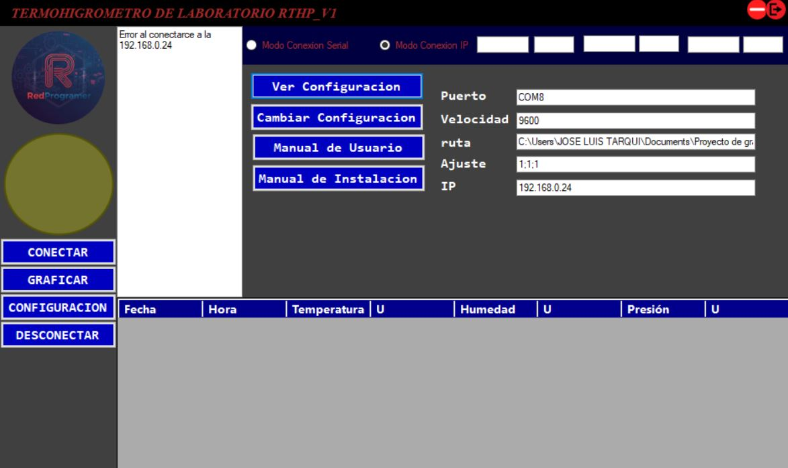

# 📊 Desarrollo de un Termobarómetro Digital basado en BMP280

## 📌 Descripción

Este proyecto presenta el diseño e implementación de un sistema de adquisición de datos para la medición de variables ambientales, específicamente **temperatura y presión atmosférica**, utilizando el sensor **BMP280**.

El sistema está compuesto por un dispositivo embebido basado en **ESP32**, complementado con una interfaz de usuario desarrollada en **C#**, permitiendo la supervisión, almacenamiento y análisis de los datos en tiempo real.

### 🔧 Componentes del sistema

* Microcontrolador: ESP32
* Sensor ambiental: BMP280 (temperatura y presión)
* Pantalla: OLED
* Módulo de tiempo real: RTC (reloj externo)
* Almacenamiento: Módulo microSD (respaldo de datos)
* Interfaz de usuario: Aplicación en C#
* Controles físicos: Botones de operación

### ⚙️ Funcionalidades principales

* Lectura continua de temperatura y presión atmosférica.
* Visualización local en pantalla OLED.
* Monitoreo en tiempo real mediante interfaz gráfica en PC.
* Configuración del sistema de adquisición.
* Almacenamiento de datos en memoria externa (microSD).
* Generación y exportación de gráficas.

---

## 🎯 Objetivo

Diseñar e implementar un sistema de medición ambiental (termobarómetro digital) junto con una interfaz gráfica en **C#**, que permita monitorear, registrar y analizar las condiciones ambientales en entornos de laboratorio.

---

## ⚙️ Tecnologías utilizadas

* Microcontrolador: ESP32
* Sensor: BMP280
* Pantalla: OLED
* Módulo RTC (tiempo real)
* Módulo de almacenamiento microSD
* Lenguaje de programación (interfaz): C# (.NET Framework)

---

## 🚀 Funcionamiento del sistema

El sistema adquiere los datos del sensor BMP280 mediante el ESP32, los cuales son:

1. Procesados y mostrados localmente en la pantalla OLED.
2. Registrados con marca de tiempo gracias al módulo RTC.
3. Almacenados en la memoria microSD como respaldo.
4. Enviados a la aplicación en C# para su visualización y análisis.

---

## 🧪 Uso

Este sistema puede utilizarse como:

* Herramienta de monitoreo ambiental en laboratorio.
* Plataforma base para proyectos de instrumentación electrónica.
* Sistema de adquisición de datos para análisis experimental.
* Apoyo en procesos de calibración de instrumentos.

Permite mejorar la precisión en la captura de datos y garantizar la trazabilidad de las mediciones.

---

## 📷 Capturas

---

## 👨‍💻 Autor

**Richard Alfredo Tarqui Mamani**

